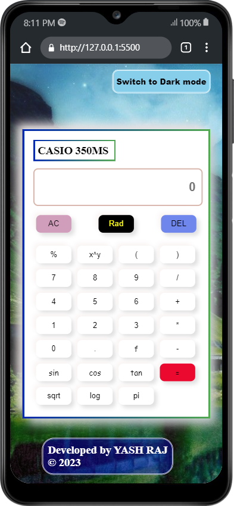
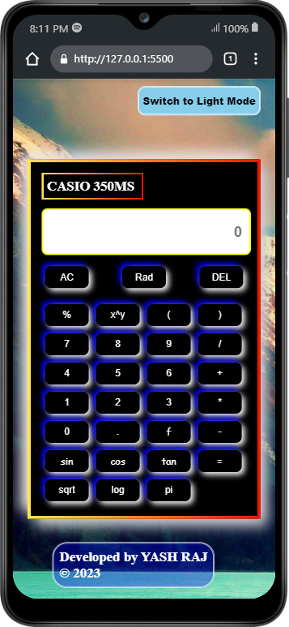

# <b>  SCIENTIFIC CALCULATOR 
------

In this project, i have developed a Fully working `Scientific Calculator` that supports almost all arithmetic and trigonometric calculations with light and dark mode feature..
Using pure HTML,CSS and Javascript.

 Project Link: https://yashraj24october.github.io/Scientific-Calculator.github.io/

## ⭐ Features
---- 
User can:
* Perform arithmetic operations like `addition, subtraction, multiplication, percentage(%),factorial,power and sqrt` of numerical values..
* Perform trigonometric functions like `sin(),cos() and tan()` of any numerical value.
* Perform logrithm(`log`) of any numerical value
* Perform calculation of `complex expression `including arithmetic,trigonometric and logrithm functions.

* For each functionality, there is defined button in calculator interface. 
There are seperate buttons for numerical value from 0 to 9 and seperate button for arithmetic operators (`+, -, *, /, %, sqrt,factorial`), trigometric functions(`sin,cos and tan`) and logrithm (log) function.
* Special toggle button for switching between Degree and radian value calculation of trigonometric functions
* There is equal (`=`) button, on clicking it, you can see your calculation result in top result box of calculator interface.

## ⭐ Special Features
_________

* Sweet Sound on each key press
* Toggle button on top-right corner of  screen for Dark and Light mode switching that gives attractive experience of using calculator.
* Automatic change of Background image of screen

________
##   📷 Screenshots
----------------
In Light Mode:

In Dark Mode:

##   Technologies Used
____

* HTML5
* CSS3
* JavaScript

## Show your Support
__________
Please ⭐️ this repository if this project helped you!

This README is created with ❤ by Yash Raj.

